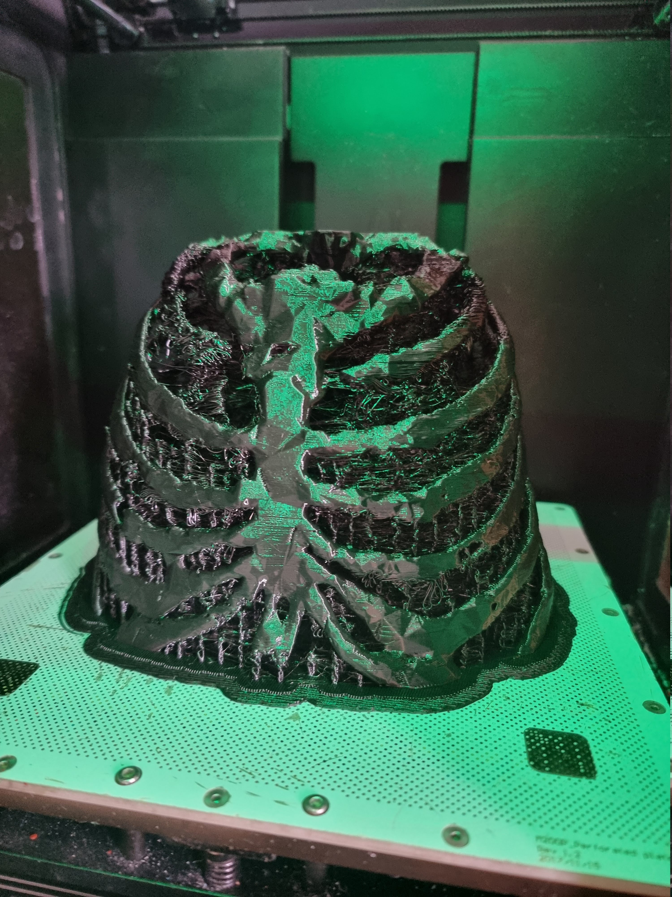
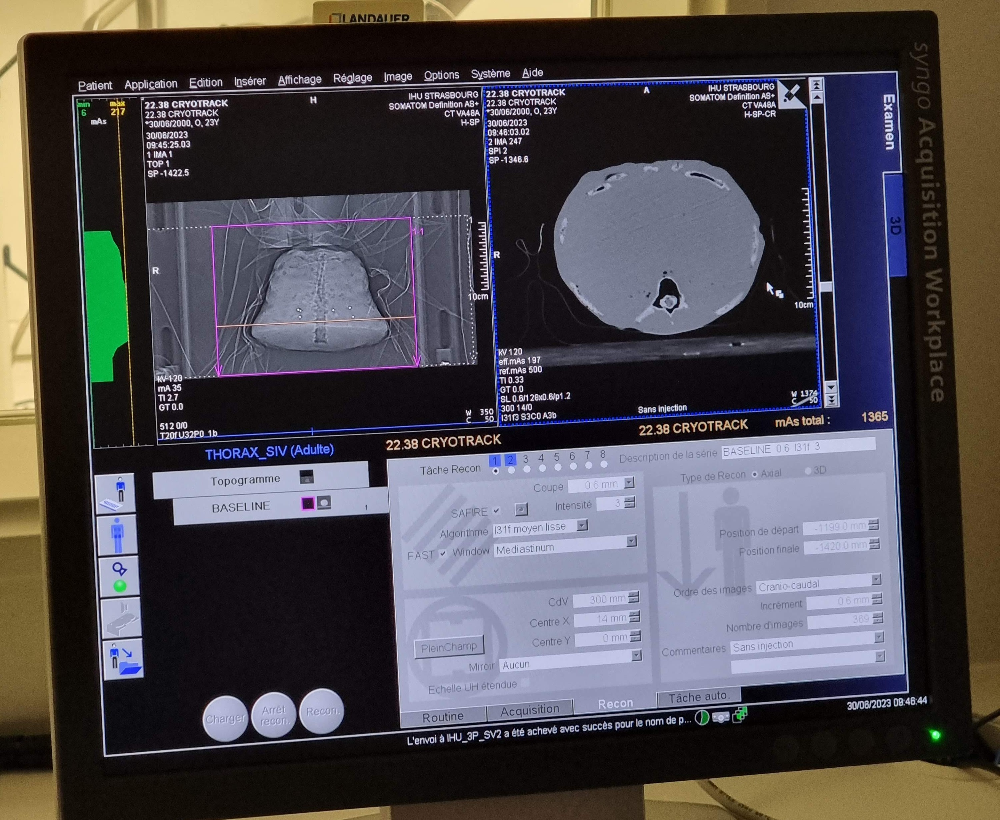
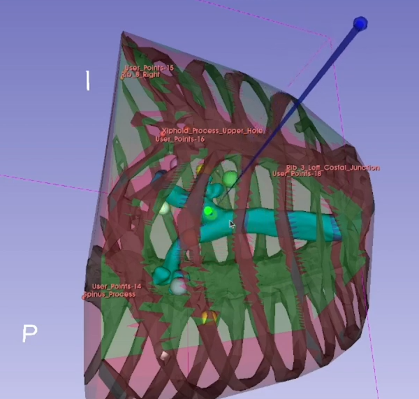

## Context

As part of my first Master’s year internship, I present to you this in depth post about my 3 month dual internship in Darmstadt, Germany and Strasbourg, France.
 
It lasted from the 1st of June to the 1st of September 2023 and was conducted in the MEC-Lab research group in the Computer Science Department at the TU Darmstadt, Germany and in the IMAGeS research group of the ICube laboratory at the University of Strasbourg, France.

## Goal of the Internship
The goal of the internship was to take over and enhance the CryoTrack project which is a non-invasive surgery assistance tool developed for the 3D Slicer software.
  
The primary focus was on synchronizing the surgical procedure with the breathing cycle. This involved the implementation of a breathing tracking tool based on multi-camera marker detection.
Another important part was the streamlining of the 3D Slicer workflow, displaying the optimal areas of entry and correcting the needle orientation during the whole procedure.



Throughout the internship, I worked extensively with Python, C++ and the 3D Slicer interface, learning to integrate a client and server for IGTLink communication between the different independent equipment pieces. I tackled challenges related to stereoscopic imaging, image processing, marker detection, synchronization of surgical procedures with breathing cycles and trajectory predictions for accurate needle placement.
  
Collaborating with the team, I tested, debugged, and collected data on different algorithm optimizations culminating in a presentation of my progress to the IMAGeS team on the 21st of July 2023.
  
The internship involved a deep dive into practical software development for non-invasive surgical guidance, contributing to the field of medical technology and patient care.

## Contributions
- Real time visual needle trajectory correction
- Needle entry area estimation and display
- Breathing tracking through multi-camera marker detection
- New interface for the CryoTrack module
- Heavy tool workflow streamlining and automation
- Quick setup and surgery preparation (less than 5 minutes)
- Increased precision and accuracy of needle placement
- Work on an EMT Linux driver

## CryoTrack Project
Triptych of the CryoTrack project



<!-- youtube vide-->


This video has been made to present the state of the project at the end of my internship.
 
The goal is to allow for quick pick up of the project by other researchers and to present the project to the public.

## Phantom
Phantoms play a crucial role in the field of surgery, serving as versatile tools for research, training and quality assurance. These phantoms are specially designed materials that mimic human tissues or structures, enabling surgeons and medical professionals to simulate and practice various surgical procedures before applying them to real patients.

<!--
Side by side images
-->
 



### Role in the project
For our tests we used a phantom of a torso at 1/2 of the scale of a grown man. We used agar-agar gel to simulate the patient's tissue. We chose agar-agar for its material properties that closely resemble the ones of human tissue and is well suited for doing magnetic resonance imaging (MRI). Agar-agar is long lasting, can be melted and re-mold and is transparent, allowing us to see inside of the phantom and do a preliminary evaluation of the efficiency of our solution.
The thoracic cage was printed using a flexible printing material called Z-Flex, the choice of this material is motivated by the need to simulate respiration and thus to deform the printed skeleton.
Within the gel matrix we suspended risk structures such as a rigid printed trachea and rigid printed target beads of differing color.

## Insertion Feasibility Map
The insertion feasibility map is a feature that allows the user to visualize the optimal entry areas for the needle placement.
 
The optimal entry areas are where the points of entry minimize the risk of damaging vital organs and structures.
 
The optimal entry areas are calculated using the patient's scan and the target position.
 
These areas are displayed as a 3D colored map on the skin of the patient's model.

<!-- Image -->


## Real Time Needle Trajectory Correction
The hard part of real time needle correction by only using a 3D visualization is to find an intuitive way to display the correction to the user. The user needs to be able to understand the correction and to be able to apply it to the needle placement and orientation.

### Targeting ring
The most intuitive solution I found was to represent the correction as a targeting ring with a sphere. The ring is displayed around the needle tip and the sphere is displayed on its edge in the opposite direction of the correction.
  
The ring is displayed in the 3D view and is always oriented towards the target.
The sphere is the direct projection of the needle end on the ring plane.
The ring's radius is the distance between the needle tip and the projection sphere.
  
The user can then use the ring to correct the needle placement and orientation by placing the projection sphere in the middle of the ring, thereby closing the ring.
 
When the ring is closed the needle is aligned with the trajectory of the needle tip to the target.
  
Adding to that there is a color code to the ring.
It lights up is green when the needle is aligned with the trajectory, yellow when the needle is closely aligned and red otherwise.
 
In the case the needle is facing away from the target at an angle greater that 90° between the needle end, its tip and the target, the ring goes gray.



 

## Studies at the CHU of Strasbourg
The CryoTrack project was tested at the CHU of Strasbourg on a phantom.
We collected data on the efficiency of the solution and the time saved by the surgeon during the procedure in the light of a coming publication.



1. Computer running the software
2. Screen for the surgeon
3. Phantom
4. Electromagnetic tracking system

## Acknowledgements

Firstly, I wish to extend my gratitude to Caroline Essert, a distinguished researcher in the IMAGeS team at the ICube lab and professor at the University of Strasbourg.
Her unwavering support and expert guidance were instrumental in my successful completion of this internship.
  
Additionally, I’d wish to thank Henry J. Krumb, a dedicated doctoral student in the MEC-Lab team and an associate professor at TU Darmstadt. Henry played a crucial role in acquainting me with the project during its initial phase and continued to provide invaluable assistance and contributions throughout the entirety of my internship.
  
I am grateful to have had the opportunity to make meaningful contributions to the CryoTrack project.

## Supplementary Material
<!--Image gallery-->





