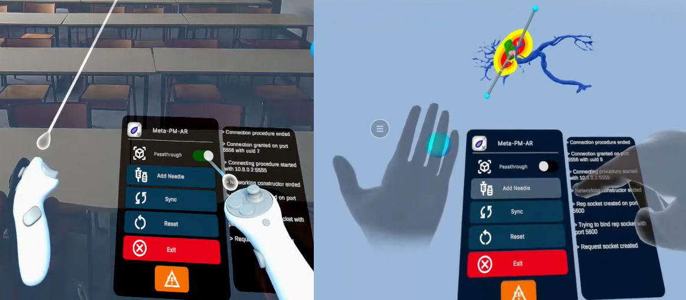
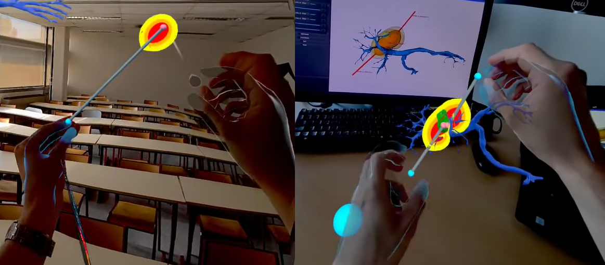

## Context and Objectives
This internship, conducted from January 29th to August 8th, 2024, in the IMAGeS research group at the ICube laboratory and the IHU of Strasbourg, focused on advancing Computer-Assisted Intervention (CAI) techniques, particularly in percutaneous cancer treatments such as thermal ablation. The core objective was to research and implement real-time simulations and integrate these into surgical planning tools, using mixed reality (MR) technologies.

The key innovation of this project lies in its use of networked computing. By offloading computationally intensive tasks to networked servers, we achieved a system capable of interactive planning without burdening the operating room (OR) with extra infrastructure. This networked approach not only optimizes the computational process but also enhances the clinical environment by focusing resources on the surgical interventions themselves.

## Achievements and Contributions
- <b>Efficient Simulations:</b> Leveraging networked computing, I implemented physical simulations that deliver results in under a second for low-resolution outputs and within five seconds for final results. Thus, interactive time planning was achieved.

<!--
Side by side images
-->
 

- <b>Co-Planning:</b> The simulation was deployed across multiple devices, connected through a secure Virtual Private Network (VPN). This allows for remote access and collaborative planning, potentially expanding the reach of expert consultations and surgical training.



- <b>Mixed Reality Integration:</b> MR tools were integrated to enhance spatial navigation and needle placement during planning. These immersive technologies proved more intuitive than traditional interfaces, offering significant improvements in the planning process.

 

- <b>3D Visualization Software:</b> The system was connected to 3D Slicer and other visualization tools, providing real-time feedback and interaction during surgical planning.



## Challenges and Solutions
- <b>Networked Computing:</b> Tackling the challenge of connecting diverse machines for efficient computation, I developed a custom networking protocol and implemented compression methods such as the modified Huffman coding. This was a cornerstone of the project, enabling the effective integration of VR/MR technologies and ensuring the system's flexibility for various deployment scenarios.



- <b>Software Optimization:</b> Significant efforts were made to optimize the software for real-time performance. This included parallelization techniques and GPU acceleration to handle large datasets and complex calculations efficiently.

## Future Prospects
This internship laid the groundwork for the upcoming PhD project, which aims to advance multi-needle planning in thermal ablation procedures. Building on the heat propagation simulation and cell death model developed during this internship, the project will focus on optimizing needle placement to improve both the speed, precision and efficiency of these procedures.

Future research could explore the incorporation of neural networks to achieve real-time planning capabilities and expand the cell death model to include hypothermia-induced cell death, broadening its clinical applicability.

## Acknowledgments
I would like to express my sincere gratitude to Pr. Caroline Essert, a distinguished researcher in the IMAGeS team at the ICube lab, for her support and guidance throughout this project. I would also like to thank Dr. Juan Verde, Preclinical Research Scientist and Innovation Manager at the IHU of Strasbourg, for his valuable insights into the practical needs of the field.

This internship marks the beginning of an exciting journey in advancing computer-assisted interventions and improving patient outcomes in thermal ablation procedures.