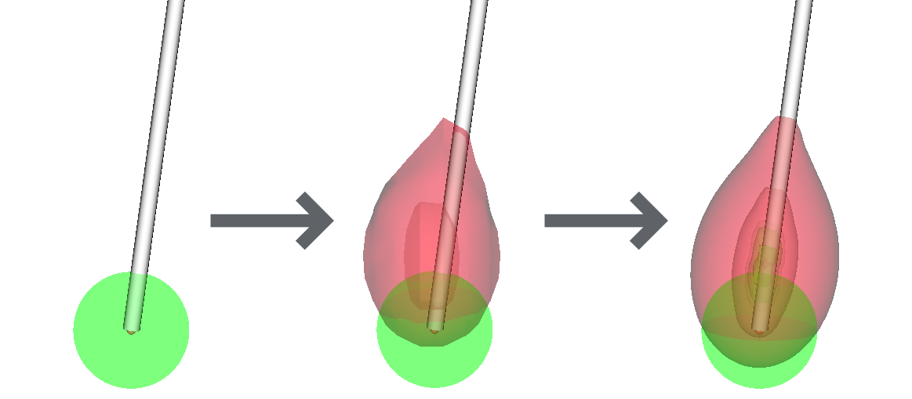
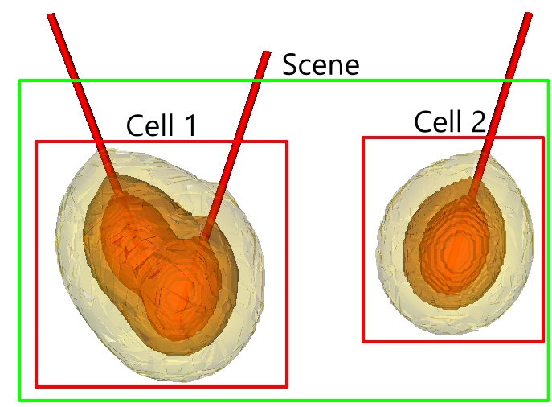
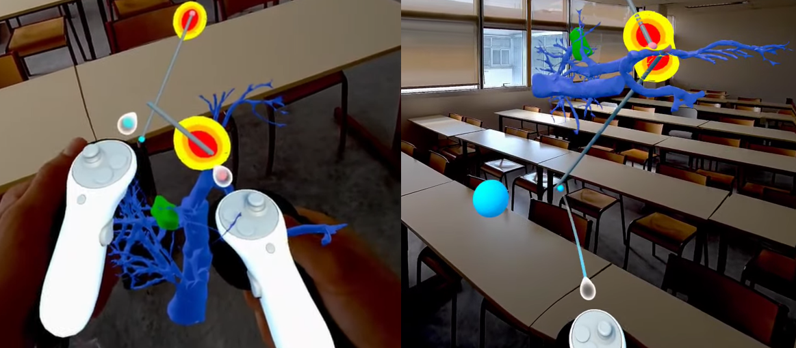

## Context and Objectives
This internship ran from January 29th to August 8th, 2024, in the IMAGeS group at the ICube laboratory and the IHU of Strasbourg. I worked on real-time simulations of thermal ablation and their integration into surgical planning tools, with mixed reality (MR) interfaces.

The simulation runs on networked servers instead of a machine inside the operating room: heavy computation is offloaded, so interactive planning works without adding hardware to the OR.

## Achievements and Contributions
- <b>Efficient simulations:</b> simulations return results in under a second at low resolution, and within five seconds for final results, which makes interactive planning possible.

<!--
Side by side images
-->
 

- <b>Co-Planning:</b> three machines ran the same planning session over a VPN, which allows remote collaboration between planners and lets an expert review a plan from outside the OR.



- <b>Mixed Reality Integration:</b> the planning workflow is also available in MR, so the planner sees needle placement directly in the patient space instead of on a flat screen.

 

- <b>3D Visualization Software:</b> The system was connected to 3D Slicer and other visualization tools, providing real-time feedback and interaction during surgical planning.



## Challenges and Solutions
- <b>Networked computing:</b> connecting different machines efficiently required a custom networking protocol and compression, such as modified Huffman coding. This is what makes the VR/MR integration and the different deployment scenarios practical.



- <b>Software optimization:</b> most of the optimization work went into parallelization and GPU acceleration to handle the large datasets within the time budget.

## Future Prospects
This internship produced the heat propagation simulation and cell death model that my PhD now builds on, targeting multi-needle planning in thermal ablation.

Future work could add neural networks for real-time planning and extend the cell death model with hypothermia-induced cell death.

## Acknowledgments
I thank Pr. Caroline Essert (IMAGeS, ICube) for her supervision, and Dr. Juan Verde, preclinical research scientist and innovation manager at the IHU of Strasbourg, for his input on the clinical requirements.